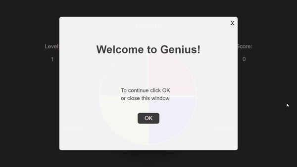

# Genius Game (projeto DIO)

Projeto desenvolvido durante o Bootcamp JavaScript Game Developer da DIO (Digital Innovation One).

O projeto consiste em uma réplica do famoso jogo Genius feito apenas com HTML, CSS e JavaScript. O objetivo é repetir a sequência das luzes que acendem.


## Demonstração :video_game:

O jogo apresenta um modal no começo do jogo com uma mensagem de boas vindas e vai registrando a pontuação do usuário e o level em que ele se encontra. Quando o jogador erra a sequência um modal aparece informando o fim do jogo e a pontuação obtida.




## Para executar o projeto :computer:

Basta clonar este repositório 

```
git clone https://github.com/davi-santos5/dio-game-genius.git
```

E executar o arquivo `index.html` no seu navegador de preferência.

